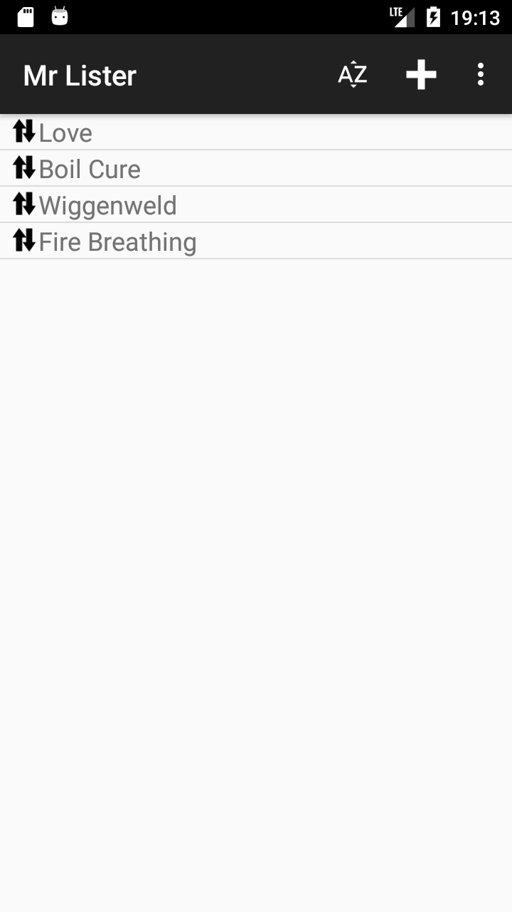
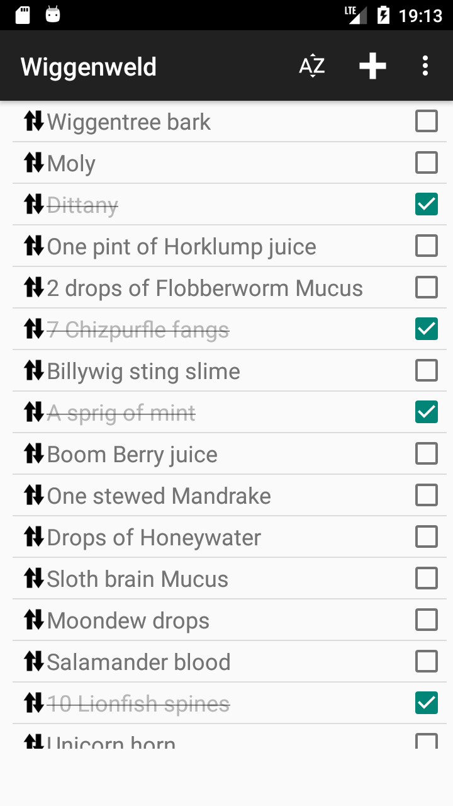
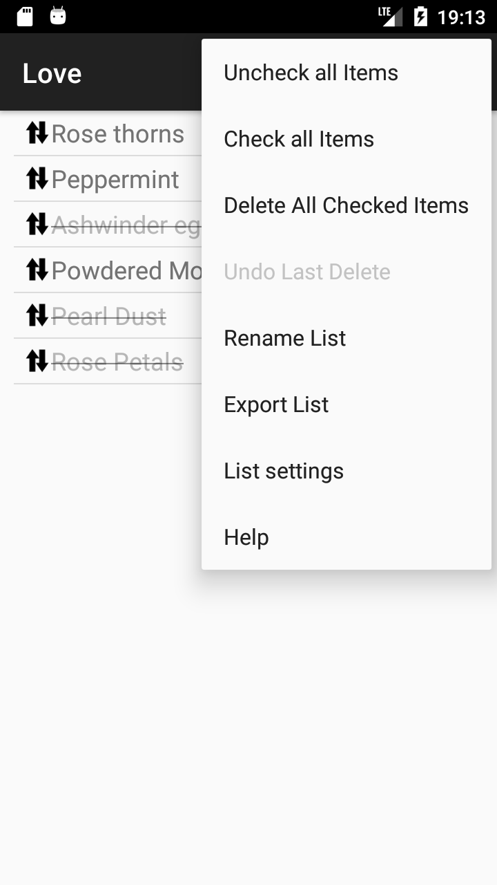

# Mr Lister
Android app that provides checkable lists with storage via ContentResolver (lists can be on SDcard,
or Google Drive, or anything else that supports the Android Content Resolver interface)

Useful for shared shopping lists, and any other kind of checklist.

  

# History
The app was inspired by the ["rList" application](https://play.google.com/store/apps/details?id=com.rundgong.shoppinglist),
which I had been using for shopping lists. I wanted a slightly different data model, that allowed
me to store lists on Google Drive and share them across a number of different devices.

# Usage
Click on the [Releases](https://github.com/cdot/Mr-Lister/releases) link on the right of the screen
to see the binary releases. Download Mr Lister-release.apk to your device and open it to install. Android
must be configured to allow installation from Unknown Sources.

[Read this to find out more about what Google considers as 'Unknown'](https://www.androidcentral.com/unknown-sources)

All the help you should need is available from inside the application - it's pretty simple!

All sources are in this repository, so you can always check the project out and build your own
version. Contributions in the form of pull requests are welcome. One sample translation is provided,
to French using automated translation so probably awful.
